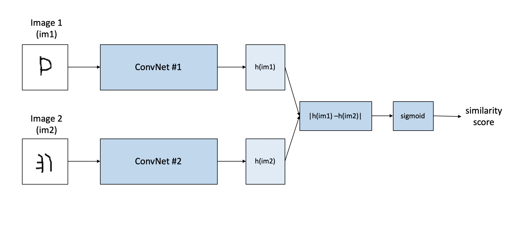

## One Shot Classification (20-way) 

**Dataset:** Omniglot, the "transpose" of MNIST, with 1623 character classes, each with 20 examples

Information about Omniglot can be found [here](https://github.com/brendenlake/omniglot). 

Data used:
  1) Training data - [images_background.zip](https://github.com/brendenlake/omniglot/blob/master/python/images_background.zip)
  2) Valuation data - [images_evaluation.zip](https://github.com/brendenlake/omniglot/blob/master/python/images_evaluation.zip)

### Siamese Network
  Give the network two images and train it to guess if they belong to the same category. 
  Input = two images, Output = p(both images share the same class) 

**Network Architecture**
The network consists of two **identical** Convolutional Neural Networks (ConvNets) for images in the pair. Then, two images (im1, im2) passed through ConvNets to generate a fixed size feature vectors as h(im1) and h(im2), respectively. Having these feature mappings, the hypothesis is as follows: 1) if two images belong to the same character, then they should have similar feature vectors. 2) if they are not same characters, then they have different feature mappings. Based on their element-wise absolute difference, the network gives a **similarity score** generated by the sigmoid layer. High level architecture is as follows: 

